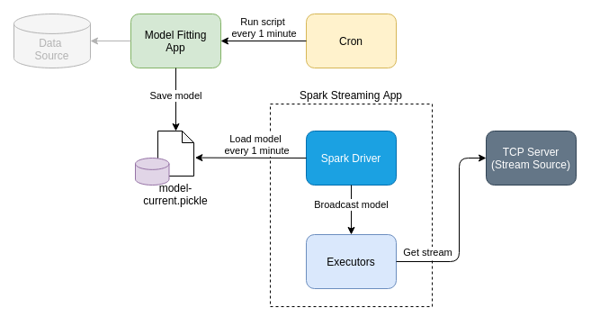

# Updatable Broadcast in Spark Streaming Application

Sergei Yu. Papulin (papulin.study@yandex.ru)

## Contents

- Prerequisites
- Spark configuration
- Datasets
- Source Code
- Model Fitting Application
- Data Transforming Application (for debugging)
- Stream Source
- Spark Streaming Application
- Running application
- References

## Prerequisites

To get started, you need to have done the following:

- Install Ubuntu 14+
- Install Java 8
- Install Anaconda (Python 3.7)
- Install Spark 2+
- Install IntelliJ 2019+ with Python Plugin or PyCharm 2019+

## Architecture

<center>



<i>Figure 1. System architecture</i>

</center>

## Source Code

- Custom Model ([custom_model.py](../projects/updatestreaming/custom_model.py))
- Model Fitting Application ([fit_model.py](../projects/updatestreaming/fit_model.py))
- Data Transforming Application (for debugging) ([transform_data.py](../projects/updatestreaming/transform_data.py))
- Stream Source ([tcp_server.py](../projects/updatestreaming/tcp_server.py))
- Spark Streaming Application ([spark_streaming_transform.py](../projects/updatestreaming/spark_streaming_transform.py))

## Custom Model

Source code: [custom_model.py](../projects/updatestreaming/custom_model.py)

Note: Fitting model application and Spark Streaming application must have access to this model class to be able to serialize/deserialize a fitted model.


```python
class CustomModel:
    """
    Custom model class that imitate a real ML model.

    :param is_cloned: The number of times to repeat an item value.
    """

    def __init__(self):
        self.is_cloned = True

    def fit(self, is_cloned):
        if not isinstance(self.is_cloned, bool):
            raise Exception("is_cloned is not boolean.")
        self.is_cloned = is_cloned

    def transform(self, item):
        """
        Transform input value based on parameter is_cloned.

        :param item: Input item.
        :return: Transformed value.
        """
        if not hasattr(self, "is_cloned"):
            raise Exception("is_cloned is not defined.")
        if self.is_cloned:
            return 3 * str(item).zfill(2)
        return str(item).zfill(2)
```

## Model Fitting Application

Source code: [fit_model.py](../projects/updatestreaming/fit_model.py)

Note: If you run a Spark application in a cluster mode, e.g. on YARN, you don't know where the driver will be launched beforehand. So in this case you have to keep the current fitted model in a shared storage such as NFS, HDFS, or even Redis.


```python
import click
from pathlib import Path
from custom_model import CustomModel


MODEL_FILENAME = "model-{}.pickle"
MODEL_OUTPUT_DIR = "models"

STATE_FILE = ".cloned"


def get_base_path(custom_path):
    """
    Add a script dir as a base to files

    Note: This is primarily needed to run the script as a cron job
    """
    path = Path(custom_path)
    if path.is_absolute():
        return path
    base_dir = Path(__file__).resolve().parent
    return base_dir / path


def is_cloned():
    state_file = get_base_path(STATE_FILE)
    if state_file.is_file():
        state_file.unlink()
        return False
    state_file.touch()
    return True


def save_model(model, output_dir):

    import pickle
    import time

    timestamp = time.strftime("%Y%m%d%H%M%S")

    path = get_base_path(output_dir)
    path.mkdir(parents=True, exist_ok=True)

    model_path = path / MODEL_FILENAME.format(timestamp)

    with open(model_path, "wb") as f:
        pickle.dump(model, f, protocol=pickle.HIGHEST_PROTOCOL)

    symlink_path = path / MODEL_FILENAME.format("current")

    if symlink_path.is_symlink():
        symlink_path.unlink()

    symlink_path.symlink_to(Path(model_path).absolute())


@click.command()
@click.option("-o", "--output", default=MODEL_OUTPUT_DIR, help="Output model directory.")
def main(output):

    model = CustomModel()
    model.fit(is_cloned())
    save_model(model, output)


if __name__ == "__main__":
    main()
```

## Data Transforming Application (for debugging)

Source code: [transform_data.py](../projects/updatestreaming/transform_data.py)

```python
import click
import time
import pickle
from custom_model import CustomModel


MODEL_INPUT_PATH = "models/model-current.pickle"


def load_model(model_path):
    with open(model_path, "rb") as f:
        return pickle.load(f)


@click.command()
@click.option("-i", "--input", "input_", default=MODEL_INPUT_PATH,
              help="Path where a model for transformation is placed.")
def main(input_):

    print("To exit press CTRL+C.")
    while True:
        model = load_model(input_)
        for i in range(20):
            print(model.transform(i))
        time.sleep(5)


if __name__ == "__main__":
    main()
```

## Stream Source

Source code: [tcp_server.py](../projects/updatestreaming/tcp_server.py)

```python
...

while True:
    for i in range(20):
        client_socket.send("{}\n".format(i).encode("utf-8"))
        print("Sent value: {}".format(i))
    sleep(delay)

...
```

## Spark Streaming Application

Source code: [spark_streaming_transform.py](../projects/updatestreaming/spark_streaming_transform.py)

Note: The CustomModel class must be exposed to a Spark Streaming application scope, otherwise a fitted model will not be deserialized.


```python
# -*- coding: utf-8 -*-

from pyspark import SparkContext
from pyspark.streaming import StreamingContext

import time
import pickle
import click


STREAM_HOST = "localhost"
STREAM_PORT = 9999

SPARK_APP_NAME = "UpdatingModelApp"
SPARK_BATCH_INTERVAL = 10
SPARK_LOG_LEVEL = "OFF"

MODEL_INPUT_PATH = "models/model-current.pickle"

MODEL_RELOAD_INTERVAL = 60


class BroadcastModel:

    def __init__(self, sc, model_path):
        self.sc = sc
        self.model_path = model_path
        self.br_model = self.load()

    def load_model(self, model_path):
        with open(model_path, "rb") as f:
            return pickle.load(f)

    def load(self):
        model = self.load_model(self.model_path)
        self.last_update = time.time()
        return self.sc.broadcast(model)

    def get(self):
        """
        Return a model

        If there is more than MODEL_RELOAD_INTERVAL seconds after
        the last update, than reload a model from an external source,
        otherwise return a current model
        """
        current_time = time.time()
        if int(current_time - self.last_update) > MODEL_RELOAD_INTERVAL:
            self.br_model.unpersist()
            self.br_model = self.load()
            self.last_update = current_time
        return self.br_model


def apply_model_wrapper(br_model):

    def apply_model(messages):
        """
        Classify messages in each partition

        Note: Commonly messages are processed on multiple nodes,
        so sklearn must be installed on each of them
        """

        # Load models
        model = br_model.value

        # Predict class of each message
        for message in messages:
            yield model.transform(message)

    return apply_model


def transform_wrapper(broadcast_model):

    def transform(rdd):
        return rdd.mapPartitions(apply_model_wrapper(broadcast_model.get()))

    return transform


@click.command()
@click.option("-h", "--host", default=STREAM_HOST, help="Stream host.")
@click.option("-p", "--port", default=STREAM_PORT, help="Stream port.")
@click.option("-m", "--model", "model_path", default=MODEL_INPUT_PATH,
              help="Path where a model for transformation is placed.")
def main(host, port, model_path):

    # Create Spark Context
    sc = SparkContext(appName=SPARK_APP_NAME)

    # Set log level
    sc.setLogLevel(SPARK_LOG_LEVEL)

    # Create Streaming Context
    ssc = StreamingContext(sc, SPARK_BATCH_INTERVAL)

    # Create an updatable broadcast model
    broadcast_model = BroadcastModel(sc, model_path)

    # Create a stream
    lines = ssc.socketTextStream(host, port)

    # Transform messages
    output = lines.transform(transform_wrapper(broadcast_model))

    # Print the result (10 records) in terminal
    output.pprint()

    # If you want to save the result in file systems
    # output.transform(lambda rdd: rdd.coalesce(1)).saveAsTextFiles("FILE_PATH")

    # Start Spark Streaming
    ssc.start()

    # Await termination
    ssc.awaitTermination()


if __name__ == "__main__":
    main()
```

## Running application

Initial structure of the project:

```shell
.
├── custom_model.py
├── fit_model.py
├── spark_streaming_transform.py
├── tcp_server.py
└── transform_data.py
```

Run the script to fit a model:

`python fit_model.py --output models`

The `models` directory will be created and used to store fitted models.

Now the project structure looks like below:

```shell
.
├── .cloned
├── custom_model.py
├── fit_model.py
├── models
│   ├── model-TIMESTAMP.pickle
│   └── model-current.pickle -> /YOUR_PATH/updatestreaming/models/model-TIMESTAMP.pickle
├── spark_streaming_transform.py
├── tcp_server.py
└── transform_data.py

```

Run the debugging script to check out whether the model was created correctly:

`python transform_data.py --input models/model-current.pickle`

You have to create a cron job that will launch the fitting model script every minute. To do this, run the following command and add the line below:

`crontab -e`

```shell
* * * * * /opt/anaconda3/bin/python3.7 /home/bigdata/PythonProjects/updatestreaming/fit_model.py --output models
```

You can check out how the cron job works by the commands below:

`grep CRON /var/log/syslog`

or

`tail /var/log/syslog`


Now run the debugging script again and make sure that the model changes its behavior every minute.

The first minute:

```shell
000000
010101
020202
030303
040404
050505
060606
070707
080808
090909
...

```

The second minute:
```shell
00
01
02
03
04
05
06
07
08
09
...
```

and so on.

If everything works correctly, start the Spark Streaming application:

`spark-submit --master local[2] spark_streaming_transform.py`

And run the TCP server to simulate a stream of data:

`python tcp_server.py`

The output of the Spark Streaming app will change periodically to match the current fitted model.


## References

[Spark Streaming Programming Guide](https://spark.apache.org/docs/2.3.0/streaming-programming-guide.html)