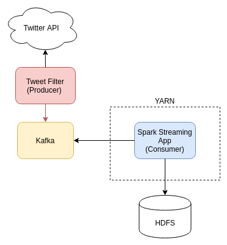

# Spark Streaming and Twitter API

Sergei Yu. Papulin (papulin.study@yandex.ru)

## Contents

- Prerequisites
- Spark configuration
- Kafka configuration
- Kafka Producer and Twitter API for Python
- Kafka Consumer and Spark Streaming Word Count
- Run and Test
- References

## Architecture


<center>



<i>Figure 1. System architecture</i>

</center>

## Spark configuration

In this tutorial the default configuration involves deploying Spark on `YARN` cluster. So you should configure, and run `HDFS` and `YARN`.

The configuration files you can find [here](https://github.com/BigDataProcSystems/Spark/blob/master/docs/spark_basics.md).

## Kafka configuration

Some examples below require the `Kafka` server as a message broker, so follow [this link](https://github.com/BigDataProcSystems/Spark/blob/master/docs/kafka_basics.md) to see guidelines that instruct how to install, configure and run `Kafka`

## Twitter API Access

https://developer.twitter.com/en

## Kafka Producer and Twitter API for Python

Install python packages for Kafka and Twitter API:

`pip install kafka-python==2.0.2 tweepy==4.2`

Create a Kafka Producer that will receive messages from Twitter API and put them in Kafka Broker for the "tweets-kafka" topic.

Source code ([tweet_kafka_producer.py](../projects/twitterstreaming/tweet_kafka_producer.py))

```python
# -*- coding: utf-8 -*-

import tweepy
import json
from kafka import KafkaProducer
import kafka.errors


# Twitter API credentials
CONSUMER_KEY = "YOUR"
CONSUMER_SECRET = "YOUR"
ACCESS_TOKEN = "YOUR"
ACCESS_TOKEN_SECRET = "YOUR"

# Kafka topic name
TOPIC_NAME = "tweets-kafka"

# Kafka server
KAFKA_HOST = "localhost"
KAFKA_PORT = "9092"


class KafkaCommunicator:
    def __init__(self, producer, topic):
        self.producer = producer
        self.topic = topic

    def send(self, message):
        self.producer.send(self.topic, message.encode("utf-8"))

    def close(self):
        self.producer.close()


class StreamListener(tweepy.Stream):
    """Listener to tweet stream from twitter."""
    def __init__(self,
                 consumer_key,
                 consumer_secret,
                 access_token,
                 access_token_secret,
                 communicator):
        super().__init__(consumer_key, consumer_secret, access_token, access_token_secret)
        self.communicator = communicator

    def on_data(self, raw_data):
        """Receiving a new data."""
        data = json.loads(raw_data)
        if "extended_tweet" in data:
            text = data["extended_tweet"]["full_text"]
            print(text)
            # put message into Kafka
            # self.communicator.send(text)
        else:
            if "text" in data:
                print(data["text"])
                # put message into Kafka
                # self.communicator.send(data["text"])

    def on_error(self, status):
        print(status)
        return True


def create_communicator():
    """Create Kafka producer."""
    producer = KafkaProducer(bootstrap_servers=KAFKA_HOST + ":" + KAFKA_PORT)
    return KafkaCommunicator(producer, TOPIC_NAME)


def create_stream(communicator):
    """Set stream for twitter api with custom listener."""
    return StreamListener(
        consumer_key=CONSUMER_KEY,
        consumer_secret=CONSUMER_SECRET,
        access_token=ACCESS_TOKEN,
        access_token_secret=ACCESS_TOKEN_SECRET,
        communicator=communicator)


def run_processing(stream):
    # Region that approximately corresponds to Moscow
    region = [34.80, 49.87, 149.41, 74.13]
    # Start filtering messages
    stream.filter(locations=region)


def main():
    communicator = None
    tweet_stream = None
    try:
        # communicator = create_communicator()
        tweet_stream = create_stream(communicator)
        run_processing(tweet_stream)
    except KeyboardInterrupt:
        pass
    except kafka.errors.NoBrokersAvailable:
        print("Kafka broker not found.")
    finally:
        if communicator:
            communicator.close()
        if tweet_stream:
            tweet_stream.disconnect()


if __name__ == "__main__":
    main()
```


## Kafka Consumer and Spark Streaming Word Count

Source code ([spark_streaming_kafka_twitter.py](../projects/twitterstreaming/spark_streaming_kafka_twitter.py))

```python
# -*- coding: utf-8 -*-

from pyspark import SparkContext
from pyspark.streaming import StreamingContext
from pyspark.streaming.kafka import KafkaUtils


SPARK_APP_NAME = "WordCountKafkaTwitter"
SPARK_CHECKPOINT_TMP_DIR = "tmp_spark_streaming"
SPARK_BATCH_INTERVAL = 10
SPARK_LOG_LEVEL = "OFF"

KAFKA_BOOTSTRAP_SERVERS = "localhost:9092"
KAFKA_TOPIC = "tweets-kafka"


def update_total_count(current_count, count_state):
    """
    Update the previous value by a new ones.

    Each key is updated by applying the given function
    on the previous state of the key (count_state) and the new values
    for the key (current_count).
    """
    if count_state is None:
        count_state = 0
    return sum(current_count, count_state)


def create_streaming_context():
    """Create Spark streaming context."""

    # Create Spark Context
    sc = SparkContext(appName=SPARK_APP_NAME)
    # Set log level
    sc.setLogLevel(SPARK_LOG_LEVEL)
    # Create Streaming Context
    ssc = StreamingContext(sc, SPARK_BATCH_INTERVAL)
    # Sets the context to periodically checkpoint the DStream operations for master
    # fault-tolerance. The graph will be checkpointed every batch interval.
    # It is used to update results of stateful transformations as well
    ssc.checkpoint(SPARK_CHECKPOINT_TMP_DIR)
    return ssc


def create_stream(ssc):
    """
    Create subscriber (consumer) to the Kafka topic and
    extract only messages (works on RDD that is mini-batch).
    """
    return (
        KafkaUtils.createDirectStream(
            ssc, topics=[KAFKA_TOPIC],
            kafkaParams={"bootstrap.servers": KAFKA_BOOTSTRAP_SERVERS})
            .map(lambda x: x[1])
    )


def main():

    # Init Spark streaming context
    ssc = create_streaming_context()

    # Get message stream
    messages = create_stream(ssc)

    # Count words for each RDD (mini-batch)
    total_counts_sorted = (
        messages
            # Word count
            .flatMap(lambda line: line.split())
            .map(lambda word: (word, 1))
            .reduceByKey(lambda x1, x2: x1 + x2)
            # Update word counts
            .updateStateByKey(update_total_count)
            # Sort by counts
            .transform(lambda x_rdd: x_rdd.sortBy(lambda x: -x[1]))
    )

    # Print result
    total_counts_sorted.pprint()

    # Start Spark Streaming
    ssc.start()

    # Waiting for termination
    ssc.awaitTermination()


if __name__ == "__main__":
    main()
```

## Run and Test

Create two py files for Kafka Producer with Twitter API connection (`kafka_producer_tweets.py`) and for Spark Streaming word count (`spark_streaming_wordcount_kafka.py`)

Start the `Zookeeper` server:

`$ZOOKEEPER_HOME/bin/zkServer.sh start &`

Run the `Kafka` server:

`$KAFKA_HOME/bin/kafka-server-start.sh $KAFKA_HOME/config/server.properties`

Create the `tweets-kafka` topic that will refer to tweet stream from Twitter API:

`$KAFKA_HOME/bin/kafka-topics.sh --create --bootstrap-server localhost:9092 --topic tweets-kafka --partitions 1 --replication-factor 1`

Open 3 terminals:

1. Run the `Kafka` console consumer:

    `$KAFKA_HOME/bin/kafka-console-consumer.sh --bootstrap-server localhost:9092 --topic tweets-kafka --from-beginning`

2. Run the producer with Twitter API:

    `python tweet_kafka_producer.py`

3. Run the Spark Streaming application:

    on YARN

    `spark-submit --packages org.apache.spark:spark-streaming-kafka-0-8_2.11:2.0.2 spark_streaming_kafka_twitter.py`

    or locally

    `spark-submit --master local[2] --packages org.apache.spark:spark-streaming-kafka-0-8_2.11:2.0.2 spark_streaming_kafka_twitter.py`


## References

[Spark Streaming Programming Guide](https://spark.apache.org/docs/2.3.0/streaming-programming-guide.html)

[Kafka Python client](https://github.com/dpkp/kafka-python)

[Kafka configuration](https://kafka.apache.org/documentation/#configuration)

[Tweepy: Twitter for Python!](https://github.com/tweepy/tweepy)

[Spark Streaming + Kafka Integration Guide](https://spark.apache.org/docs/2.3.0/streaming-kafka-0-8-integration.html)