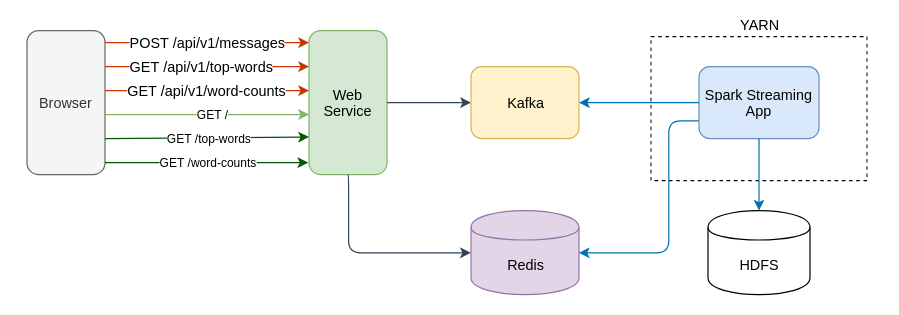
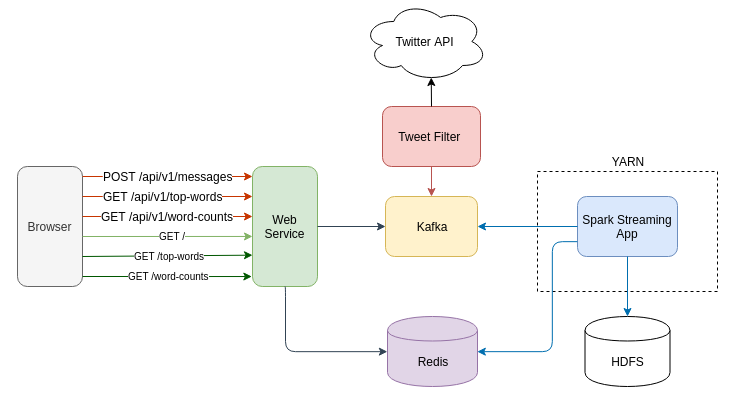

# Web Service with Spark Streaming and Kafka
Sergei Yu. Papulin (papulin.study@yandex.ru)

## Contents

- Prerequisites
- Spark configuration
- Kafka configuration
- Installing and running Redis
- Web service
- Running as OS service
- Spark Streaming Application
- Deploying Web Service and Spark Streaming application

## Prerequisites

General:

- Ubuntu 14+
- Java 8
- Hadoop 3.2.0
- Spark 2.3
- Kafka 2.3.0
- Redis 5.0.6

Python coding (for `Spark Streaming App` and `Tweet Filter App`):
- PyCharm or IntelliJ 2019.2 with Python Plugin
- Python 3.7
- python-kafka (for Kafka)
- tweepy (for Twitter API)

Java coding (for `Web Service`):
- IntelliJ 2019.2
- Spring Boot starters 2.1.8
- Spring for Apache Kafka 2.2.0
- Spring Data Redis 2.1.8
- Jedis 2.9.3


## Spark configuration

In this tutorial the default configuration involves deploying Spark on `YARN` cluster. So you should configure, and run `HDFS` and `YARN`.

The configuration files you can find [here](spark_basics.md).

## Kafka configuration

Some examples below require the `Kafka` server as a message broker, so follow [this link](kafka_basics.md) to see guidelines that instruct how to install, configure and run `Kafka`

## Installing and running Redis 

#### With sudo

`apt install redis-server`

#### Without sudo

Download the `Redis` release:

`wget -P ~/redis/source http://download.redis.io/releases/redis-5.0.6.tar.gz`

Extract the archive:

`tar -xvzf ~/redis/redis-5.0.6.tar.gz --directory ~/redis --strip-components 1`

Compile `Redis`:

`cd ~/redis && make`

#### Starting Redis Server

Run the `Redis` server:

`$REDIS_HOME/src/redis-server`

To check the server run the `Redis` CLI and enter the `PING` command:

`$REDIS_HOME/src/redis-cli`

```
127.0.0.1:6379> PING
PONG
```

#### Python Redis client


Install `redis-py`:

`pip install redis --user` (optional)


## Web service

[Source code](../projects/webservice/service/WordCountService)


<center><i>Figure 1. Web Service Architecture</i></center>

```
./src
├── main
│   ├── java
│   │   └── edu
│   │       └── classes
│   │           └── spark
│   │               ├── Application.java
│   │               ├── configurations
│   │               │   ├── KafkaConfiguration.java
│   │               │   └── RedisConfiguration.java
│   │               ├── controllers
│   │               │   ├── WordCountAPIServiceController.java
│   │               │   └── WordCountWebServiceController.java
│   │               ├── models
│   │               │   ├── Message.java
│   │               │   └── WordCountPair.java
│   │               └── services
│   │                   ├── IWordCountService.java
│   │                   └── WordCountService.java
│   └── resources
│       ├── application.yml
│       ├── static
│       └── templates
│           ├── index.html
│           ├── top_words.html
│           └── word_counts.html
└── test
    └── java

```

#### Running service

`mvn spring-boot:run`

Or create a `jar` file and run the service as follows:

`java -jar ./target/wordcount-service-1.0.jar`

#### Creating jar

Create a `jar` executable file to run the service as a standalone application in the Tomcat container:

`mvn clean package`


```bash
[INFO] Scanning for projects...
[INFO] 
[INFO] ----------------< edu.classes.spark:wordcount-service >-----------------
[INFO] Building wordcount-service 1.0
[INFO] --------------------------------[ jar ]---------------------------------
[INFO] 
[INFO] --- maven-clean-plugin:3.1.0:clean (default-clean) @ wordcount-service ---
[INFO] 
[INFO] --- maven-resources-plugin:3.1.0:resources (default-resources) @ wordcount-service ---
[INFO] Using 'UTF-8' encoding to copy filtered resources.
[INFO] Copying 1 resource
[INFO] Copying 3 resources
[INFO] 
[INFO] --- maven-compiler-plugin:3.8.1:compile (default-compile) @ wordcount-service ---
[INFO] Changes detected - recompiling the module!
[INFO] Compiling 9 source files to /media/sf_Spark_Streaming/projects/webservice/service/WordCountService/target/classes
[INFO] 
[INFO] --- maven-resources-plugin:3.1.0:testResources (default-testResources) @ wordcount-service ---
[INFO] Using 'UTF-8' encoding to copy filtered resources.
[INFO] skip non existing resourceDirectory /media/sf_Spark_Streaming/projects/webservice/service/WordCountService/src/test/resources
[INFO] 
[INFO] --- maven-compiler-plugin:3.8.1:testCompile (default-testCompile) @ wordcount-service ---
[INFO] Changes detected - recompiling the module!
[INFO] 
[INFO] --- maven-surefire-plugin:2.22.2:test (default-test) @ wordcount-service ---
[INFO] 
[INFO] --- maven-jar-plugin:3.1.2:jar (default-jar) @ wordcount-service ---
[INFO] Building jar: /media/sf_Spark_Streaming/projects/webservice/service/WordCountService/target/wordcount-service-1.0.jar
[INFO] 
[INFO] --- spring-boot-maven-plugin:2.1.8.RELEASE:repackage (repackage) @ wordcount-service ---
[INFO] Replacing main artifact with repackaged archive
[INFO] ------------------------------------------------------------------------
[INFO] BUILD SUCCESS
[INFO] ------------------------------------------------------------------------
[INFO] Total time:  12.984 s
[INFO] Finished at: 2019-11-19T13:09:51+03:00
[INFO] ------------------------------------------------------------------------

```

The output jar file (`wordcount-service-1.0.jar`) has the following structure:

```
.
├── BOOT-INF
│   ├── classes
│   │   ├── application.yml
│   │   ├── edu
│   │   │   └── classes
│   │   │       └── spark
│   │   │           ├── Application.class
│   │   │           ├── configurations
│   │   │           ├── controllers
│   │   │           ├── models
│   │   │           └── services
│   │   └── templates
│   └── lib
├── META-INF
│   ├── MANIFEST.MF
│   └── maven
│       └── edu.classes.spark
│           └── wordcount-service
│               ├── pom.properties
│               └── pom.xml
└── org
    └── springframework
        └── boot
            └── loader
```


The `MANIFEST.MF` file looks as

```
Manifest-Version: 1.0
Implementation-Title: wordcount-service
Implementation-Version: 1.0
Start-Class: edu.classes.spark.Application
Spring-Boot-Classes: BOOT-INF/classes/
Spring-Boot-Lib: BOOT-INF/lib/
Build-Jdk-Spec: 1.8
Spring-Boot-Version: 2.1.8.RELEASE
Created-By: Maven Archiver 3.4.0
Main-Class: org.springframework.boot.loader.JarLauncher
```

## Running as OS service


#### Upstart (for Ubuntu 14.04)

Create a configuration file `/etc/init/wordcount-service.conf` with the following content:

```bash
description "Word Count Web Service"

# run processes on behalf of the bigdata user 
setuid bigdata

start on runlevel [2345]
stop on runlevel [!2345]

respawn
respawn limit 10 5 # by default

# command to execute
exec /media/sf_Spark_Streaming/projects/webservice/service/WordCountService/target/wordcount-service-1.0.jar
```

Start the service using the `start` command: 

`sudo service wordcount-service start | stop | restart`

Show runtime status information:

`sudo service wordcount-service status`


Check whether the service is running:

`jps`

```
6948 wordcount-service-1.0.jar
7117 Jps
```

You can find logs as follows:

`sudo cat /var/log/upstart/wordcount-service.log`

or

`tail -n 100 /var/log/syslog`


#### Systemd (for Ubuntu 16+)

Create a configuration file `/etc/systemd/system/wordcount-service.service` with the following content:

```ini
[Unit]
Description=Word Count Web Service
After=syslog.target

[Service]
Type=simple
User=bigdata
ExecStart=/media/sf_Spark_Streaming/projects/webservice/service/WordCountService/target/wordcount-service-1.0.jar
Restart=always
RestartSec=4

[Install]
WantedBy=multi-user.target
```

Start the service using the `start` command: 

`sudo systemctl start | stop | restart wordcount-service`

If you change a configuration file (`*.service`), you should reload the daemon:

`sudo systemctl daemon-reload`

And then restart your service:

`sudo systemctl restart wordcount-service`

Show runtime status information:

`sudo systemctl status wordcount-service`

You can find logs as follows:

`journalctl --no-pager -u wordcount-service`

or

`tail -n 100 /var/log/syslog`

## Twitter API


<center><i>Figure 2. Additional Kafka producer with Twitter API </i></center>

## Spark Streaming Application

#### Kafka consumer

Apply the Kafka consumer as an input source. Below code snippet exemplifies how to use Kafka inside a `Spark Streaming` application. The full source code is available [here](../projects/webservice/sparkstreaming)

```python
import json

from pyspark.streaming.kafka import KafkaUtils


KAFKA_BOOTSTRAP_SERVERS = "localhost:9092"
KAFKA_TOPIC = "wordcount"

# Create subscriber (consumer) to the Kafka topic
kafka_stream = KafkaUtils.createDirectStream(ssc, 
                                             topics=[KAFKA_TOPIC],
                                             kafkaParams={"bootstrap.servers": KAFKA_BOOTSTRAP_SERVERS})

# Extract a content of messages from Kafka topic stream (per mini-batch)
lines = kafka_stream.map(lambda x: json.loads(x[1])["content"])

```

#### Redis client

```python
REDIS_HOST = "127.0.0.1"
REDIS_PORT = 6379
REDIS_CHARSET = "utf-8"
REDIS_DECODE_RESPONSES = True

REDIS_KEY_WORD_COUNT = "count_word"
REDIS_KEY_TOP_10_WORD = "top_10_words"

def save_partition_in_redis(partition):
    """
    Insert/update word count pairs in Redis for each partition

    Note: minus for the count variable in r.zadd() is a workaround to
    guarantee lex ordering when word counts have the same value.
    The sign should be removed when consume this Redis sorted set.
    """
    import redis
    r = redis.Redis(host=REDIS_HOST, port=REDIS_PORT, charset=REDIS_CHARSET, decode_responses=REDIS_DECODE_RESPONSES)
    for row in partition:
        r.zadd(REDIS_KEY_WORD_COUNT, {row[0]: -row[1]})


def save_rdd_in_redis(time, rdd):
    """Insert/update word count pairs in Redis"""
    rdd.foreachPartition(save_partition_in_redis)


def save_top_10_in_redis(time, rdd):
    """
    Insert/update top 10 words

    Note: minus for the count variable in r.zadd() is a workaround to
    guarantee lex ordering when word counts have the same value.
    The sign should be removed when consume this Redis sorted set.
    """
    import redis
    r = redis.Redis(host=REDIS_HOST, port=REDIS_PORT, charset=REDIS_CHARSET, decode_responses=REDIS_DECODE_RESPONSES)
    r.delete(REDIS_KEY_TOP_10_WORD)
    top_10_words = rdd.takeOrdered(10, key=lambda x: -x[1])
    for word, count in top_10_words:
        r.zadd(REDIS_KEY_TOP_10_WORD, {word: -count})


# Save word counts in redis (job 1)
total_counts.foreachRDD(save_rdd_in_redis)

# Save top 10 words in redis (job 2)
total_counts.foreachRDD(save_top_10_in_redis)
```


## Deploying Web Service and Spark Streaming application

#### Starting HDFS and Spark on YARN

Run `HDFS` and `YARN`

`$HADOOP_HOME/sbin/start-dfs.sh && $HADOOP_HOME/sbin/start-yarn.sh`

Run `History Server`

`$SPARK_HOME/sbin/start-history-server.sh`

Check whether all daemons are running

`jps`

Web UI:
- YARN Resource Manager port: `8088`
- Spark History Server port: `18080`
- Spark Cluster port: `8080` (for standalone cluster mode)

#### Launching Kafka Server

Start the `Zookeeper` Server:

`$ZOOKEEPER_HOME/bin/zkServer.sh start`

Run the `Kafka` server:

`$KAFKA_HOME/bin/kafka-server-start.sh $KAFKA_HOME/config/server.properties`

#### Starting Redis Server

`$REDIS_HOME/src/redis-server`

#### Submitting Spark Streaming Application

Earlier we configured Spark to being run on `YARN`. So the following command runs a spark streaming application on `YARN` by default:

`spark-submit --packages org.apache.spark:spark-streaming-kafka-0-8_2.11:2.0.2 wordcount_streaming.py`

To run locally use the command below:

`spark-submit --master local[2] --packages org.apache.spark:spark-streaming-kafka-0-8_2.11:2.0.2 wordcount_spark_streaming.py`

#### Launching Web Service

Start/stop the web service as a managed process by command (see configuration above):

`sudo service wordcount-service start | stop | restart` (for Ubuntu 14.04)

or

`sudo systemctl start | stop | restart wordcount-service` (for Ubuntu 16+)

You can also run it as an unmanaged process as follows:

`java -jar ./target/wordcount-service-1.0.jar`


```
  .   ____          _            __ _ _
 /\\ / ___'_ __ _ _(_)_ __  __ _ \ \ \ \
( ( )\___ | '_ | '_| | '_ \/ _` | \ \ \ \
 \\/  ___)| |_)| | | | | || (_| |  ) ) ) )
  '  |____| .__|_| |_|_| |_\__, | / / / /
 =========|_|==============|___/=/_/_/_/
 :: Spring Boot ::        (v2.1.8.RELEASE)


......


2019-11-19 13:36:51.407  INFO 9475 --- [           main] edu.classes.spark.Application            : Started Application in 9.698 seconds (JVM running for 10.986)
2019-11-19 13:37:08.348  INFO 9475 --- [nio-8080-exec-1] o.a.c.c.C.[Tomcat].[localhost].[/]       : Initializing Spring DispatcherServlet 'dispatcherServlet'
2019-11-19 13:37:08.349  INFO 9475 --- [nio-8080-exec-1] o.s.web.servlet.DispatcherServlet        : Initializing Servlet 'dispatcherServlet'
2019-11-19 13:37:08.391  INFO 9475 --- [nio-8080-exec-1] o.s.web.servlet.DispatcherServlet        : Completed initialization in 42 ms
```

To stop the running service, you can press `CTRL-C` or find its `PID` by the command:

`jps`

And kill the process:

`kill PID`


# References

[How To Install and Secure Redis on Ubuntu 18.04](https://www.digitalocean.com/community/tutorials/how-to-install-and-secure-redis-on-ubuntu-18-04)

[An introduction to Redis data types and abstractions](https://redis.io/topics/data-types-intro)

[Spark Streaming Programming Guide](https://spark.apache.org/docs/2.3.0/streaming-programming-guide.html)

[PySpark Streaming Module API](https://spark.apache.org/docs/2.3.0/api/python/pyspark.streaming.html)

[Jedis](https://github.com/xetorthio/jedis)

[Spring Data Redis](https://docs.spring.io/spring-data/data-redis/docs/current/reference/html/#reference)
